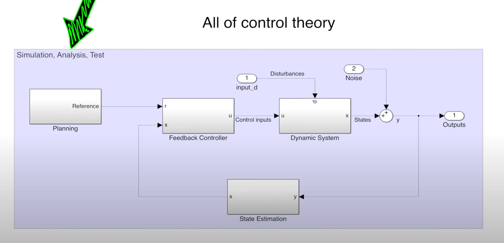

# Control theory

https://www.youtube.com/watch?v=lBC1nEq0_nk

- Planning: which path/reference should the controller follow? (A*, ...)
- Feedback / feedforward controller (linear, non-linear, robust, adaptive, predictive, optimal, intelligent)
- Dynamic system (Wind, bumps in the road, ...)
- State estimation (Kalman filtering, particle filter, running average) 
  - deals with noise
- Simulation, analysis, test: 
  - simulate system 
  - plot metrics 
  - does the system meet requirements?
- Sensors to observe every state
  - Spedometer can observe speed and acceleration (take derivative)

--> many different mathematical models used